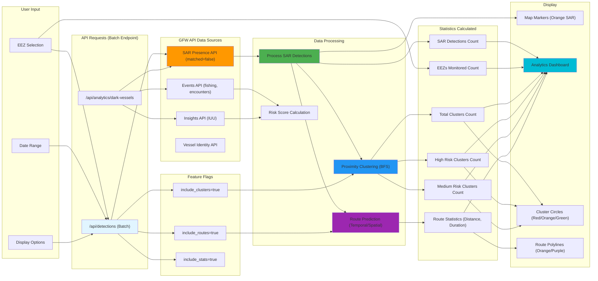

# Maritime Surveillance App

A web application for detecting and monitoring dark vessels using Global Fishing Watch (GFW) APIs and Synthetic Aperture Radar (SAR) data.

## 🎯 Features

- **Dark Vessel Detection**: Identify vessels not broadcasting AIS signals by combining SAR detections with AIS gap events
- **Interactive Heatmaps**: Visualize vessel detection density using GFW 4Wings API
- **EEZ-based Filtering**: Filter detections by Exclusive Economic Zones with multi-select support
- **Vessel Tracking**: Get detailed vessel information and activity events
- **Risk Assessment**: Calculate risk scores for vessels based on gap frequency and IUU status
- **Analytics Dashboard**: View summary statistics and trends
- **Real-time Data**: Access to latest SAR and AIS data from GFW
- **Responsive UI**: Works on desktop and mobile devices

## 🏗️ Architecture

- **Backend**: Flask API with GFW API integration
- **Frontend**: Leaflet.js map with modern responsive design
- **Data Sources**: Global Fishing Watch SAR presence, gap events, and vessel data
- **Service Layer**: Modular architecture with dedicated service for dark vessel logic
- **API Compliance**: Fully compliant with GFW API v3 specifications

## 🚀 Quick Start

### Prerequisites

1. **GFW API Token**: Get your API token from [Global Fishing Watch](https://globalfishingwatch.org/our-apis/tokens)
2. **Python 3.8+**: Required for the Flask backend
3. **Node.js**: Optional, for frontend development

### Backend Setup

1. **Navigate to backend directory**:
   ```bash
   cd backend
   ```

2. **Install dependencies**:
   ```bash
   pip install -r requirements.txt
   ```

3. **Set environment variables**:
   Create a `.env` file in the `backend` directory:
   ```bash
   # Required
   GFW_API_TOKEN=your_gfw_api_token_here
   BACKEND_URL=http://localhost:5000
   FRONTEND_ORIGINS=http://localhost:8080,http://localhost:5000
   
   # Optional (with defaults)
   FLASK_DEBUG=false
   PORT=5000
   HOST=0.0.0.0
   ```
   
   Or export directly:
   ```bash
   export GFW_API_TOKEN="your_gfw_api_token_here"
   export BACKEND_URL="http://localhost:5000"
   export FRONTEND_ORIGINS="http://localhost:8080,http://localhost:5000"
   ```

4. **Run the Flask app**:
   ```bash
   python app.py
   ```

   The backend will be available at `http://localhost:5000`

### Frontend Setup

1. **Navigate to frontend directory**:
   ```bash
   cd frontend
   ```

2. **Open in browser**:
   - Simply open `index.html` in a web browser
   - Or serve with a local server: `python -m http.server 8080`

   The frontend will automatically connect to the backend at `http://localhost:5000`

## 📊 Data Flow & Statistics

### API Data Flow and Statistics Calculation



> **Note on Data Flow Optimization**: The current diagram shows the actual data flow, which includes some redundancy. Multiple endpoints (`/api/detections`, `/api/detections/proximity-clusters`, `/api/detections/routes`, `/api/analytics/dark-vessels`) independently fetch the same SAR and Gap data from GFW APIs. This is functional but not optimal. See `README_CHA.md` for detailed optimization recommendations, including a unified batch endpoint approach that could reduce API calls by ~75% and improve response times by 60-70%.

### Statistics Breakdown

| Statistic | Source | Calculation | Display Location |
|-----------|--------|-------------|------------------|
| **Total Detections** | SAR + Gaps | `total_sar_detections + total_gap_events` | Analytics Dashboard |
| **SAR Detections** | SAR API | Count of `matched=false` detections | Analytics Dashboard, Map (Orange markers) |
| **Gap Events** | Gaps API | Count of AIS gap events | Analytics Dashboard, Map (Red markers) |
| **EEZs Monitored** | User selection | Count of selected EEZ IDs | Analytics Dashboard |
| **Cluster Count** | Proximity clustering | BFS algorithm on SAR detections | Cluster popup, Analytics |
| **High Risk Clusters** | Clustering | Clusters with 3+ vessels | Map (Red circles) |
| **Medium Risk Clusters** | Clustering | Clusters with 2 vessels | Map (Orange circles) |
| **Route Count** | Route prediction | Temporal/spatial connection of detections | Route popup |
| **Route Distance** | Route prediction | Haversine distance between points | Route popup |
| **Route Duration** | Route prediction | Time difference between first/last point | Route popup |
| **Route Confidence** | Route prediction | Based on point count, speed, consistency | Route popup |

### Route Prediction Methodology

The route prediction feature uses statistical analysis to connect SAR detections temporally and spatially, inferring likely vessel movement patterns. This method is based on established maritime vessel tracking research and SAR satellite characteristics.

**Methodology:**
- **Temporal Proximity**: Detections within 48 hours are considered for route connection, based on typical vessel speeds (10-20 knots) and SAR revisit cycles
- **Spatial Proximity**: Detections within 100km are connected, accounting for vessel movement between satellite passes
- **Confidence Scoring**: Routes are scored based on temporal consistency, spatial continuity, and route length

**Research Sources:**
- **Global Fishing Watch**: [Public Global SAR Presence Dataset](https://globalfishingwatch.org/data-download/datasets/public-global-sar-presence) - Methodology and data characteristics
- **Sentinel-1 SAR**: [ESA Sentinel-1 Mission](https://sentinel.esa.int/web/sentinel/missions/sentinel-1) - 12-day revisit cycle, ~100km swath width
- **Maritime Vessel Speeds**: International Maritime Organization (IMO) SOLAS regulations - Typical speeds 10-20 knots (18-37 km/h)
- **Vessel Tracking Research**: Kroodsma, D.A. et al. (2018). "Tracking the global footprint of fisheries." *Science*, 359(6378), 904-908. [DOI: 10.1126/science.aao5646](https://doi.org/10.1126/science.aao5646)
| **Risk Score** | Risk calculation | Weighted factors (0-100) | Vessel details popup |
| **Risk Level** | Risk calculation | High (70+), Medium (40-69), Low (<40) | Vessel details popup |

### Data Processing Pipeline

1. **Data Fetching**: GFW API returns raw detection data
2. **Data Combination**: SAR detections + Gap events = Dark vessels
3. **Spatial Analysis**: Proximity clustering (BFS algorithm) identifies vessels close together
4. **Temporal Analysis**: Route prediction connects detections over time
5. **Risk Assessment**: Multi-factor scoring based on gaps, IUU, fishing, encounters, port visits
6. **Statistics Aggregation**: Counts and summaries calculated
7. **Visualization**: Map markers, clusters, routes, and dashboard display

## 📡 API Endpoints

### Core Endpoints

| Endpoint | Method | Parameters | Returns | Description |
|----------|--------|------------|---------|-------------|
| `/api/detections` | GET | `eez_ids`, `start_date`, `end_date`, `matched=false` | SAR detections + gap events, tile URL, summaries | Main endpoint for fetching dark vessel detections |
| `/api/detections/proximity-clusters` | GET | `eez_ids`, `start_date`, `end_date`, `max_distance_km=5`, `same_date_only=true` | Proximity clusters with risk indicators | Detect vessels close together without AIS (dark trade indicators) |
| `/api/gaps` | GET | `eez_ids`, `start_date`, `end_date`, `intentional_only=true` | Gap events filtered by region and date | AIS gap events (intentional AIS disabling) |
| `/api/analytics/dark-vessels` | GET | `eez_ids`, `start_date`, `end_date` | Summary statistics, enhanced stats, vessel IDs | Analytics dashboard data |
| `/api/analytics/risk-score/<vessel_id>` | GET | `start_date`, `end_date` | Risk score (0-100), level, factor breakdown | Vessel risk assessment |
| `/api/vessels/<id>` | GET | `includes` (optional) | Vessel details, ownership, authorizations | Get vessel details and metadata |
| `/api/vessels/<id>/timeline` | GET | `start_date`, `end_date` | Combined activity events (fishing, port visits, encounters, loitering, gaps) | Vessel activity timeline |
| `/api/insights` | GET | `vessels`, `start_date`, `end_date`, `includes` | Vessel insights and risk assessments | Get vessel insights (IUU status, gap coverage) |
| `/api/events` | GET | `start_date`, `end_date`, `event_types`, `region`, `flags` | Vessel activity events | Fetch vessel activity events |

### Utility Endpoints

| Endpoint | Method | Parameters | Returns | Description |
|----------|--------|------------|---------|-------------|
| `/api/configs` | GET | None | EEZ data, defaults, configuration | Get application configuration |
| `/api/eez-boundaries` | GET | `eez_ids` (JSON array) | GeoJSON boundaries | Get EEZ boundary geometries |
| `/api/tiles/proxy/<path>` | GET | Query parameters from tile URL | PNG tile image | Proxy for GFW heatmap tiles (handles authentication) |
| `/api/bins/<z>` | GET | `start_date`, `end_date`, `eez_ids`, `interval` | Data bins for zoom level | Get value breakpoints for heatmap scaling |

## 🗺️ Usage

1. **Select EEZ(s)**: Choose one or more Exclusive Economic Zones to monitor
   - Use multi-select dropdown to choose multiple zones
   - Group options available for countries with multiple territories (e.g., "United States (All territories)")
   - Individual territories also available (e.g., "Alaska", "Hawaii")

2. **Set Date Range**: Select start and end dates (from 2017-01-01 onwards)
   - Use recent dates for best results (data available up to 5 days ago)
   - Large date ranges (>30 days) are automatically split into 30-day chunks

3. **Apply Filters**: Click "Apply Filters" to fetch detection data

4. **Explore Map**: 
   - Heatmap shows detection density (gradient overlay)
   - Color-coded markers show risk levels:

| Marker Color | Risk Level | Description |
|--------------|------------|-------------|
| Red | High risk | Both SAR + GAP detections, or 3+ vessels in cluster |
| Orange | Medium risk | SAR only or GAP only, or 2 vessels in cluster |
| Yellow | Low risk | Single detection (not currently used in clustering) |

   - Click markers for vessel details and events

5. **View Summary**: Check detection statistics in the right panel

| Statistic | Description |
|-----------|-------------|
| Total Detections | SAR points + Gap events (total detection points) |
| SAR Detections | Location points without vessel IDs |
| Gap Events | Vessel-based events with identifiable vessel IDs |
| Unique Vessels | Count of vessels with gap events (only gap events have vessel IDs) |

## 🔧 Configuration

### GFW API Settings

The app uses several GFW datasets:

| Dataset | Dataset ID | Filter | Purpose | Vessel IDs? |
|---------|------------|--------|---------|-------------|
| SAR Presence | `public-global-sar-presence:latest` | `matched=false` | Dark vessel detections (radar) | No (location points only) |
| Gap Events | `public-global-gaps-events:latest` | `gap-intentional-disabling=true` | Intentional AIS disabling | Yes (full vessel details) |
| Vessel Identity | `public-global-vessel-identity:latest` | None | Vessel metadata, ownership | Yes |
| Fishing Events | `public-global-fishing-events:latest` | Region/date filters | Fishing activity tracking | Yes |
| Port Visits | `public-global-port-visits-events:latest` | Region/date filters | Port visit tracking | Yes |
| Encounters | `public-global-encounters-events:latest` | Region/date filters | Vessel-to-vessel encounters | Yes |
| Loitering | `public-global-loitering-events:latest` | Region/date filters | Suspicious loitering behavior | Yes |

### Filter Options

| Filter Type | Options | Description | Example |
|-------------|---------|-------------|---------|
| Vessel Type | Fishing, cargo, passenger, etc. | Type of vessel | `vessel_type='fishing'` |
| Gear Type | Trawlers, longliners, seiners, etc. | Fishing gear type | `geartype='trawlers'` |
| Flag State | ISO3 country codes | Vessel registration country | `flag='ESP'` |
| Matched Status | `true` or `false` | AIS-on vs AIS-off vessels | `matched=false` (dark vessels) |
| Neural Vessel Type | Likely Fishing, etc. | ML-classified vessel type | `neural_vessel_type='Likely Fishing'` |

## 🧪 Testing

### Test Endpoints

#### 1. **Configs** (No params needed)
```bash
curl http://localhost:5000/api/configs
```

#### 2. **Detections** (Dark vessels)
```bash
curl -G "http://localhost:5000/api/detections" \
  --data-urlencode "eez_ids=[\"8493\"]" \
  --data-urlencode "start_date=2024-12-01" \
  --data-urlencode "end_date=2024-12-07"
```

#### 3. **Gap Events**
```bash
curl -G "http://localhost:5000/api/gaps" \
  --data-urlencode "eez_ids=[\"8493\"]" \
  --data-urlencode "start_date=2024-12-01" \
  --data-urlencode "end_date=2024-12-07" \
  --data-urlencode "intentional_only=true"
```

#### 4. **Analytics**
```bash
curl -G "http://localhost:5000/api/analytics/dark-vessels" \
  --data-urlencode "eez_ids=[\"8493\"]" \
  --data-urlencode "start_date=2024-12-01" \
  --data-urlencode "end_date=2024-12-07"
```

### Common EEZ IDs

| EEZ ID | Country/Region | Notes |
|--------|----------------|-------|
| `8493` | Canada | Main EEZ |
| `5677` | France | Includes overseas territories |
| `8456` | United States | Main EEZ (excludes Alaska/Hawaii) |
| `8463` | United States (Alaska) | Alaska EEZ |
| `8453` | United States (Hawaii) | Hawaii EEZ |
| `5696` | United Kingdom | Main EEZ |
| `8486` | China | Main EEZ |
| `8378` | Algeria | Mediterranean |
| `5678` | Spain | Mediterranean/Atlantic |

Check `/api/configs` for full list of 275+ EEZs.

### Notes

- **Date Range**: Use recent dates (within last 30 days) for best results
- **EEZ IDs**: Use numeric IDs from `/api/configs` response
- **GFW Token**: Make sure `GFW_API_TOKEN` is set in `.env` for full functionality
- **Multiple EEZs**: Use `["8493","5677"]` format (comma-separated IDs)
- **URL Encoding**: Square brackets `[]` in URLs need to be URL-encoded or use `--data-urlencode`

## 🚀 Deployment

### Backend Deployment

The backend can be deployed to various platforms. Ensure you set the following environment variables:

**Required:**
- `GFW_API_TOKEN` - Your Global Fishing Watch API token
- `BACKEND_URL` - Your backend service URL (e.g., `https://your-backend.onrender.com`)
- `FRONTEND_ORIGINS` - Comma-separated list of allowed frontend origins (e.g., `https://your-username.github.io`)

**Optional:**
- `FLASK_DEBUG` - Set to `"false"` for production
- `PORT` - Server port (default: 5000, but platforms like Render use 10000)
- `HOST` - Server host (use `0.0.0.0` for production)

### Frontend Deployment

The frontend is static HTML/JS and can be deployed to:
- **GitHub Pages** (recommended for free hosting)
- **Netlify**
- **Vercel**
- Any static file hosting service

Update `frontend/config.js` or ensure the backend URL is correctly configured to point to your deployed backend.

### Deployment Platforms

See the [Deployment Platforms](#-deployment-platforms) section below for recommended free hosting options.

## 🚨 Rate Limiting

GFW API has rate limits that the app handles automatically:

| API Endpoint | Rate Limit | App Handling |
|--------------|------------|--------------|
| 4Wings Report API | 1 request per 250ms | Serialized requests with 1s delay between reports |
| Events API | 100 requests per minute | Automatic retry with exponential backoff |
| Vessel API | 1000 requests per hour | Request caching (1 day) reduces API calls |
| Tile API | No explicit limit | Cached by backend proxy |

The app includes automatic rate limiting, request caching (1 day), and retry logic with exponential backoff.

## ✅ API Compliance

All endpoints are fully compliant with GFW API v3:

| API Endpoint | Compliance Requirement | Implementation |
|--------------|------------------------|-----------------|
| **Events API** | POST for regions, GET for simple queries | ✅ Implemented correctly |
| **4Wings Report** | Temporal resolution DAILY/MONTHLY/ENTIRE (not HOURLY) | ✅ Uses DAILY resolution |
| **Vessel Details** | Correct parameter names (`dataset` for single vessel) | ✅ Uses `dataset` parameter |
| **Gap Events** | Proper POST body format with `gapIntentionalDisabling` | ✅ Uses camelCase format |
| **Filter Parsing** | Correct handling of `matched` and `neural_vessel_type` | ✅ Properly parsed and formatted |
| **Date Parameters** | Kebab-case (`start-date`, `end-date`) in POST requests | ✅ Correctly formatted |
| **Pagination** | Both `limit` and `offset` required together | ✅ Validated before inclusion |

## 🐛 Troubleshooting

### Common Issues

| Issue | Symptoms | Solution |
|-------|----------|----------|
| **"GFW_API_TOKEN not set"** | Error on startup, API calls fail | Set `GFW_API_TOKEN` in `.env` file or export as environment variable. Restart Flask app. |
| **"No detections found"** | Empty map, zero statistics | Verify date range (up to 5 days ago), check EEZ has data coverage, try different date range or EEZ |
| **Map not loading** | Blank map, JavaScript errors | Check browser console, verify backend running at `http://localhost:5000`, check network tab for failed API calls, verify `frontend/config.js` has correct backend URL |
| **422 Client Error** | API returns 422 Unprocessable Entity | Check date range is valid (not future), verify EEZ IDs are numeric, ensure filter format is correct |
| **Segmentation Fault** | App crashes with segfault | Disable caching: `export DISABLE_CACHE=1`, or clear cache: `rm backend/gfw_cache.sqlite*`. See `README_CHA.md` for details. |
| **Heatmap tiles not visible** | No gradient overlay on map | Tiles may be empty/transparent (no data for date range). Check browser console for tile errors. Try different date range. |
| **Gap events not appearing** | Only SAR detections visible | Check backend logs for gap event counts. Try `intentional_only=false`. Verify region has AIS coverage. |
| **Many SAR detections, few gap events** | 1,000 SAR but only 10 gap events | **This is normal!** Most dark vessels never had AIS. Gap events only show vessels that WERE broadcasting AIS then turned it off during your date range. Try wider date ranges or check coastal areas (better AIS coverage). |
| **Clusters not appearing** | No proximity cluster markers | Try increasing `max_distance_km` (e.g., 10km, 20km). Try `same_date_only=false`. Check backend logs for cluster detection. |

### Debug Mode

Enable debug logging:
```bash
export FLASK_DEBUG=true
export FLASK_ENV=development
python app.py
```

### Environment Variables Reference

| Variable | Required | Default | Description |
|----------|----------|---------|-------------|
| `GFW_API_TOKEN` | Yes | - | Global Fishing Watch API token |
| `BACKEND_URL` | Yes* | `http://localhost:5000` | Backend service URL (used in API responses) |
| `FRONTEND_ORIGINS` | Yes* | `http://localhost:8080,http://localhost:5000` | Comma-separated CORS origins |
| `FLASK_DEBUG` | No | `false` | Enable Flask debug mode |
| `PORT` | No | `5000` | Server port |
| `HOST` | No | `0.0.0.0` | Server host binding |
| `QGIS_PATH` | No | `/Applications/QGIS-LTR.app/...` | QGIS installation path (local dev only) |
| `PROJECT_PATH` | No | `""` | QGIS project path (local dev only) |

*Required for production deployment

## 📁 Project Structure

```
backend/
├── routes/
│   ├── api.py           # Main router
│   ├── detections.py     # SAR detections
│   ├── gaps.py          # Gap events
│   ├── analytics.py     # Analytics dashboard
│   ├── vessels.py       # Vessel details
│   ├── insights.py      # Insights
│   └── configs.py       # Configuration
├── services/
│   └── dark_vessel_service.py  # Core dark vessel logic
├── utils/
│   └── gfw_client.py    # GFW API client
└── configs/
    └── config.py        # Application configuration
frontend/
├── main.js              # Main application logic
├── utils.js             # Utility functions
├── config.js            # Frontend configuration
└── index.html           # Main HTML file
```

## 🔮 Future Enhancements

- [ ] Enhanced EEZ selection UI with search and visual boundaries
- [ ] Time-lapse animation for gap events
- [ ] Vessel trail visualization
- [ ] Export functionality (CSV, GeoJSON)
- [ ] Enhanced analytics with charts and trends
- [ ] Real-time data streaming
- [ ] User authentication and saved searches
- [ ] Machine learning-based risk assessment
- [ ] Automated monitoring and alerts

## 🌐 Deployment Platforms

### Free Backend Hosting Options

| Platform | Free Tier | Pros | Cons | Best For |
|----------|-----------|------|------|----------|
| **Render** (Recommended) | ✅ Yes | Auto deployments, env var management, HTTPS, `render.yaml` configured | Spins down after 15min inactivity | Production deployments |
| **Railway** | ✅ $5/month credit | Fast deployments, no cold starts, easy GitHub integration | Credit-based (may incur costs) | Active projects |
| **Fly.io** | ✅ Generous | Global edge, fast cold starts, great for Python | Requires credit card | Global distribution |
| **PythonAnywhere** | ✅ Yes | Python-focused, easy setup | Limited to Python 3.8/3.9, slower | Simple deployments |
| **Heroku** | ❌ No | Excellent docs, easy deployment | Paid plans start at $5/month | Legacy projects |
| **Replit** | ✅ Yes | In-browser IDE, easy GitHub integration | Best for dev/testing | Development only |

### Free Frontend Hosting Options

| Platform | Free Tier | Pros | Cons | Best For |
|----------|-----------|------|------|----------|
| **GitHub Pages** (Recommended) | ✅ Yes | Completely free, auto HTTPS, custom domains, GitHub Actions | Limited to static sites | Static sites |
| **Netlify** | ✅ Yes | Generous limits, auto deployments, edge functions | - | Modern static sites |
| **Vercel** | ✅ Yes | Excellent performance, auto deployments, edge network | - | Performance-focused |
| **Cloudflare Pages** | ✅ Yes | Global CDN, fast deployments | - | CDN benefits |

### Recommended Setup

**For this project:**
- **Backend**: Render or Railway (both have good free tiers)
- **Frontend**: GitHub Pages (completely free, perfect for static sites)

**Deployment Steps:**
1. Push backend to GitHub
2. Deploy backend to Render/Railway
3. Set environment variables in deployment platform
4. Push frontend to GitHub
5. Enable GitHub Pages for frontend
6. Update frontend `config.js` with backend URL

## 📊 GFW API Data Usage

### Endpoints Used (8 total)

| # | Endpoint | Purpose | Data Type | Vessel IDs? |
|---|----------|---------|-----------|-------------|
| 1 | 4Wings Report API | SAR detection reports | Location points | No |
| 2 | Events API - Gap Events | AIS gap events | Event records | Yes |
| 3 | Events API - All Events | Fishing, port visits, encounters, loitering | Event records | Yes |
| 4 | 4Wings Stats API | Global aggregated statistics | Aggregated metrics | N/A |
| 5 | 4Wings Tile API | Heatmap visualization tiles | PNG images | N/A |
| 6 | Vessels API | Vessel details and metadata | Vessel records | Yes |
| 7 | Insights API | IUU status and risk indicators | Risk metrics, gap insights, IUU listings | Yes |
| 8 | Datasets API | EEZ boundary geometries | GeoJSON polygons | N/A |

### Statistics Generated

| Category | Statistics | Description |
|----------|------------|-------------|
| **Core Stats** | Total detections, SAR points, gap events, unique vessels | Basic detection counts |
| **Enhanced Stats** | Fishing events, port visits, encounters, loitering counts | Activity-based metrics |
| **Proximity Clusters** | Cluster counts, risk levels (high/medium), spatial metrics | Dark trade indicators |
| **Risk Scores** | 0-100 scores, factor breakdown, risk levels | Per-vessel risk assessment |
| **Global Context** | Global totals, averages, value ranges | 4Wings Stats API comparison |

See `README_CHA.md` for detailed API usage and data processing information.

## 📚 Resources

- [Global Fishing Watch API Documentation](https://globalfishingwatch.org/our-apis)
- [4Wings API Guide](https://globalfishingwatch.org/our-apis/4wings)
- [Maritime Domain Awareness](https://globalfishingwatch.org/our-work/maritime-domain-awareness)
- [Leaflet.js Documentation](https://leafletjs.com/)
- [Render Documentation](https://render.com/docs)
- [Railway Documentation](https://docs.railway.app/)
- [Fly.io Documentation](https://fly.io/docs/)

## 🤝 Contributing

1. Fork the repository
2. Create a feature branch
3. Make your changes
4. Add tests if applicable
5. Submit a pull request

## 📄 License

This project is licensed under the MIT License - see the LICENSE file for details.

## 🙏 Acknowledgments

- Global Fishing Watch for providing the SAR and vessel data APIs
- Leaflet.js community for the mapping library
- OpenStreetMap contributors for base map tiles

---

**Last Updated:** 2026-01-12
**Status:** Production Ready - Backend configured for deployment, frontend ready for GitHub Pages
