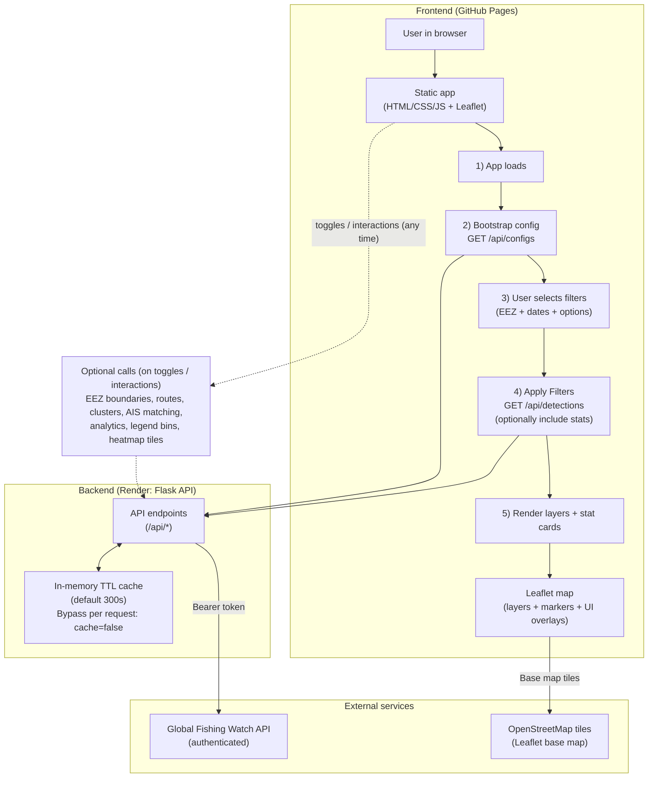

# Maritime Surveillance

Explore “dark” maritime activity using Global Fishing Watch SAR detections, with lightweight clustering and best‑effort route inference.

## What the map shows
- **SAR detections**: unmatched SAR points (no vessel identity)
- **Dark traffic clusters**: proximity grouping (heuristic “risk” labels)
- **Route prediction**: temporal + spatial linking of SAR points (not confirmed tracks)
- **EEZ filtering**: pick one or more EEZs and a date range, then load data

## How route prediction works
Routes are inferred by chaining detections within a **time window** and **distance window**:
- **Distance**: great‑circle distance (Haversine)
- **Link rule**: connect to the “best next” point that is close in space and time (greedy)
- **Confidence**: increases with point count and is penalized for unrealistic implied speeds

Defaults (can be tuned in requests): **48 hours**, **100 km**, **min 2 points**.

## Run it locally

### Backend
```bash
cd backend
pip install -r requirements.txt
export GFW_API_TOKEN="..."
export FRONTEND_ORIGINS="http://localhost:8080"
python app.py
```

### Frontend
```bash
cd frontend
python -m http.server 8080
```
Open `http://localhost:8080`.

## Deploy (GitHub Pages)

This repo publishes GitHub Pages from the `docs/` folder on `main`.

- **Source of truth**: `frontend/`
- **Published bundle**: `docs/` (must be kept in sync)

To publish changes:

```bash
./scripts/sync_docs.sh
pytest -q
git add docs
git commit -m "docs: sync publish bundle"
git push origin main
```

## App flowchart



- **Performance**: expensive endpoints are cached in-process (per Render instance). Use `?cache=false` to bypass.
- **Identity**: SAR detections are often **unmatched** and typically do **not** include vessel identity; routes/clusters are best‑effort heuristics.

## API endpoints

### Config / health
- **GET** `/healthz`: Render health check
- **GET** `/api/health`: health check (JSON)
- **GET** `/api/configs`: frontend bootstrap config (EEZ list + defaults + backend URL)

### EEZ
- **GET** `/api/eez-boundaries`: EEZ boundary GeoJSON for selected EEZ IDs

### Detections / “dark traffic”
- **GET** `/api/detections`: main data endpoint (SAR detections + optional batches)
  - **feature flags**: `include_clusters=true`, `include_routes=true`, `include_stats=true`
- **GET** `/api/detections/proximity-clusters`: clusters SAR detections by distance/time (heuristic risk)
- **GET** `/api/detections/routes`: best‑effort route inference by linking SAR points (time + distance windows)
- **GET** `/api/detections/sar-ais-association`: summary of SAR detections matched vs unmatched to AIS (counts + %)
- **GET** `/api/tiles/proxy/<path>`: tile proxy to GFW (keeps token server-side)

### Analytics
- **GET** `/api/analytics/dark-vessels`: analytics summary for selected EEZ + date range (includes some global context)
- **GET** `/api/analytics/risk-score/<vessel_id>`: compute a vessel risk score over a date range

### Events
- **GET** `/api/events`: fetch event entries (fishing/encounters/port visits/loitering) with optional region filtering

### Vessels / insights
- **GET** `/api/vessels/<vessel_id>`: vessel details (optional `includes=...`)
- **GET** `/api/vessels/<vessel_id>/timeline`: vessel event timeline (requires `start_date` + `end_date`)
- **POST** `/api/insights`: vessel insights request (gaps/IUU/coverage-style signals)

### Legend helpers
- **GET** `/api/bins/<zoom_level>`: value breakpoints for heatmap legend styling

## Key backend env vars
- **GFW_API_TOKEN**: required
- **FRONTEND_ORIGINS**: comma‑separated origins (no paths), e.g. `https://charlotteprevost.github.io`
- **BACKEND_URL**: the public backend base URL (Render)

## Repo layout
- `backend/`: Flask API (routes + services)
- `frontend/`: static UI (Leaflet + vanilla JS)
- `docs/`: GitHub Pages build output (static copy)
